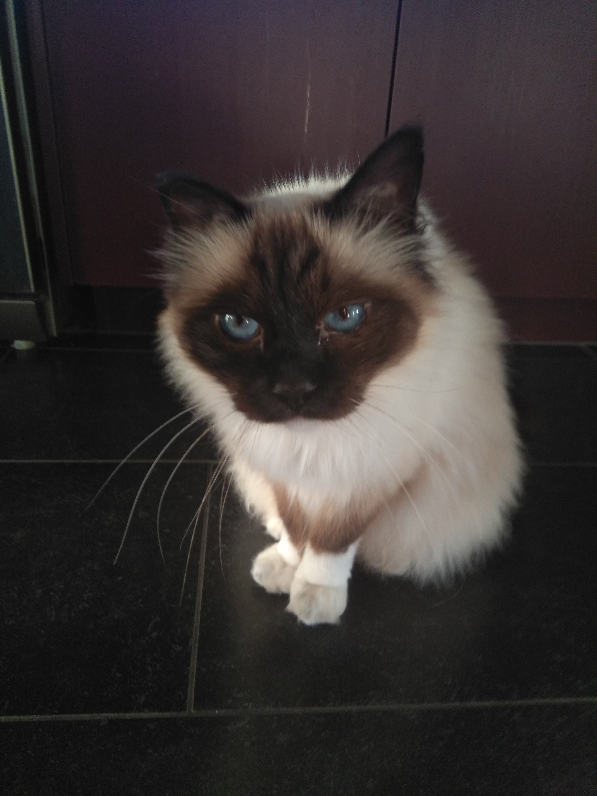
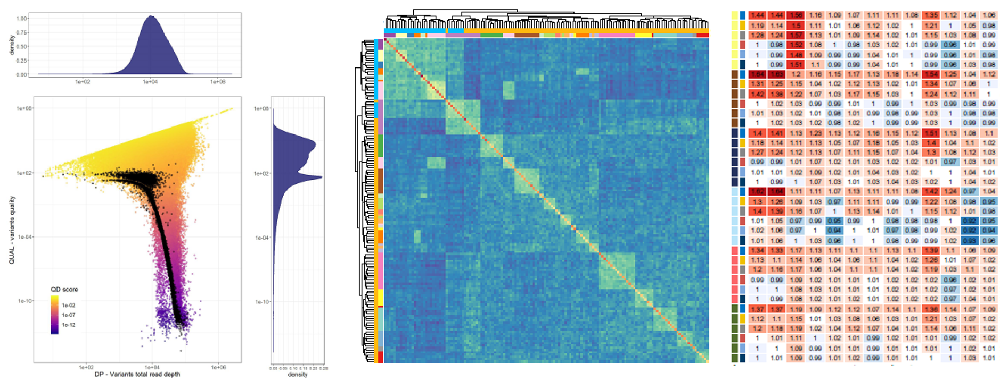

```{r setup, include=FALSE}
library(tidyverse)
library(palmerpenguins)
penguins = na.omit(penguins)
#data(package = 'palmerpenguins')
knitr::opts_chunk$set(echo = TRUE)
knitr::opts_chunk$set(fig.dim=c(4.8, 4.5), fig.retina=2, out.width="100%")
```

class: middle

## Welcome

---

## Teaching team

Jonathan Marshall         |  Olivia Angelin-Bonnet
--------------------------|----------------------------
ScB3.17                   |  ScB3.27
j.c.marshall@massey.ac.nz |  angelin-bonnet@massey.ac.nz

---

## Who am I?

<div align="center">
<span class='inline'>
  <a href="http://instagram.com/monstamini"></a>
  
  
</span>
</div>

- I'm a statistician with two pets and one kid.

- Interested in statistical modelling of disease.

- Two main areas: [spatio-temporal modelling](https://jmarshallnz.github.io/talks/nzsa2016), and [source attribution](jmarshallnz.github.io/talks/OHA2019).

---

## Who am I?

.pull-left[

]


.pull-right[


- I'm a PhD student in (bio)statistics

- I'm interested in analysis of large biological datasets, networks, and visualisation

- Currently studying multi-omics data integration and biological networks inference

<br>


]
---

class: middle, inverse

# Who are you?

---

## Plan

- Learn a bit of R and RStudio

- Workshop style (i.e. I'll talk for a bit, then you do stuff for a bit, rinse + repeat).

- R/RStudio is something that takes a while to learn. Generally you learn while doing.

- This course gives you a taster. Copy and paste (and google!) is your friend!

---

## Plan: Today

9:00 - 9:10 Intro - these slides

9:10 - 10:40 Visualisation 1

10:40 - 11:00 Morning tea

11:00 - 12:45 Visualisation 2

12:45 - 1:45 Lunch

1:45 - 3:30 Data Transformation 1

3:30 - 4:00 Afternoon tea

4:00 - 5:00 Catchup/revision lab

---

## Plan: Tomorrow

9:00 - 10:40 Data Transformation 2

10:40 - 11:00 Morning tea

11:00 - 12:45 Tidying data

12:45 - 1:45 Lunch

1:45 - 3:30 Modelling

3:30 - 4:00 Afternoon tea

4:00 - 5:00 Catchup/revision lab

---

## Let's get RStudio going

- Make sure you've got R and RStudio installed.

- Download the zip file here: https://www.massey.ac.nz/~jcmarsha/intro_to_r.zip

- Unzip to somewhere convenient.

- Double click on `intro_to_r.Rproj`

---

## RStudio projects

- The `intro_to_r.rProj` acts as a 'base folder'.

- Anything we load from there will be relative to the base.

- e.g. to load some data, we'll be using paths that look like: `"data/<blah>"`

- It is generally a good idea to use an RStudio project for each bit of analysis.

- Then all data/code etc can be organised in there, and it's somewhat self-contained.

- You can still read data from elsewhere - just supply a fully qualified path.

---

## Finding help

- The cheatsheets in RStudio (Help -> Cheatsheets).

- The tidyverse website: https://tidyverse.org

- RStudio cloud primers: https://rstudio.cloud/learn/primers

- R for Datascience book: https://r4ds.had.co.nz

- Google is super useful! Include "R" or "RStudio" or maybe the name of the package "ggplot" or "dplyr" in
your query.

- Check the date of the google responses: older results might well be out of date.

