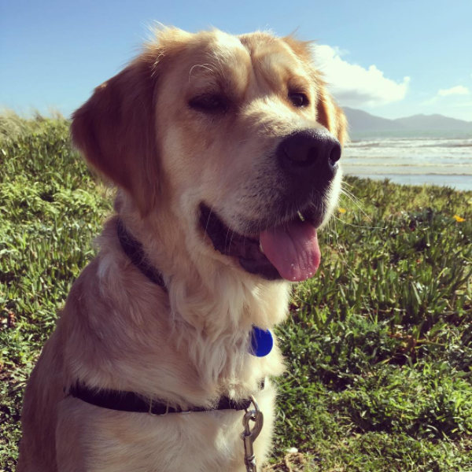
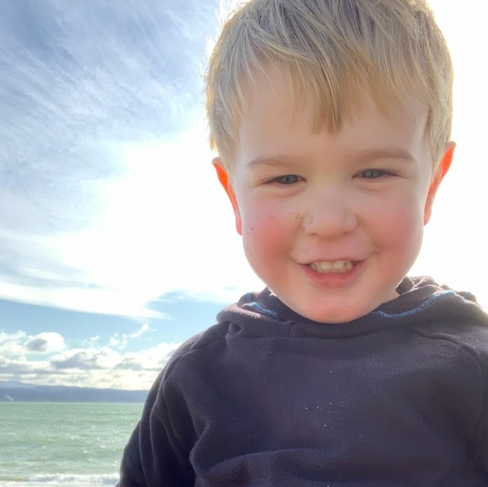

```{r setup, include=FALSE}
library(tidyverse)
library(palmerpenguins)
penguins = na.omit(penguins)
#data(package = 'palmerpenguins')
knitr::opts_chunk$set(echo = TRUE)
knitr::opts_chunk$set(fig.dim=c(4.8, 4.5), fig.retina=2, out.width="100%")
```

class: middle

## Welcome

---

## Teaching team

In order of appearance:

Jonathan Marshall         |  Olivia Angelin-Bonnet
--------------------------|----------------------------
ScB3.17                   |   ScB3.15
j.c.marshall@massey.ac.nz |   angelin-bonnet@massey.ac.nz

---

## Who am I?

<div align="center">
<span class='inline'>
  <a href="http://instagram.com/monstamini"></a>
  
  
</span>
</div>

- I'm a statistician with two pets and one kid.

- Interested in statistical modelling of disease.

- Two main areas: [spatio-temporal modelling](https://jmarshallnz.github.io/talks/nzsa2016), and [source attribution](jmarshallnz.github.io/talks/OHA2019).

---

## Plan

- Learn a bit of R and RStudio

- Workshop style (i.e. I'll talk for a bit, then you do stuff for a bit, rinse + repeat).

- R/RStudio is something that takes a while to learn. Generally you learn while doing.

- This course gives you a taster. Copy and paste (and google!) is your friend!

---

## Plan: Today

9:00 - 9:10 Intro - these slides
9:10 - 10:40 Visualisation 1.
10:40 - 11:00 Morning tea.
11:00 - 12:45 Visualisation 2.
12:45 - 1:45 Lunch
1:45 - 3:30 Transformation 1.
3:30 - 4:00 Afternoon tea.
4:00 - 5:00 Catchup/revision lab.

---

## Plan: Tomorrow

9:00 - 10:40 Transformation 2.
10:40 - 11:00 Morning tea.
11:00 - 12:45 Modelling 1.
12:45 - 1:45 Lunch
1:45 - 3:30 Modelling 2.
3:30 - 4:00 Afternoon tea.
4:00 - 5:00 Catchup/revision lab.

---

## Working with R/RStudio

- Loading it up.
- Console vs scripts.
- Projects for organisation.

---

## Getting data into RStudio

- read_csv()
- Where does it read from?
- Relative vs absolute paths.
- read_excel()
- Best practices

---

## Finding help

---
