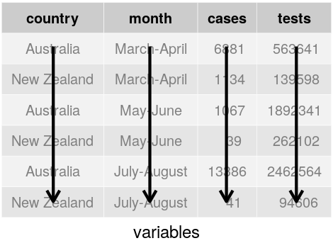
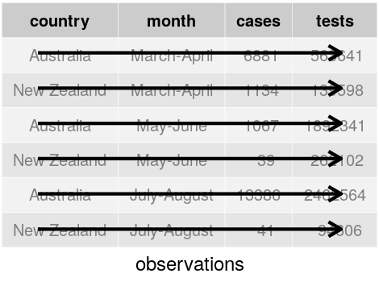
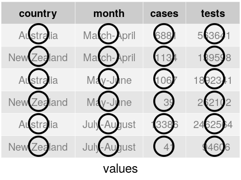
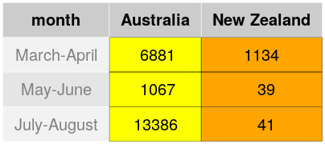
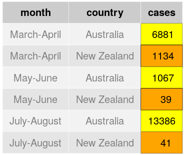
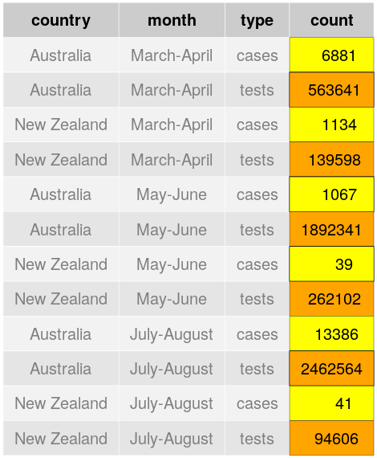
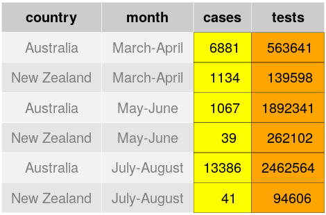

```{r setup, include=FALSE}
library(tidyverse)
library(lubridate)
library(palmerpenguins)
#data(package = 'palmerpenguins')
knitr::opts_chunk$set(echo = TRUE, comment = "")
knitr::opts_chunk$set(fig.dim=c(4.8, 4.5), fig.retina=2, out.width="100%")
hrc <- read_csv(here::here("data/horizons_river_quality/horizons_river_ecoli.csv"))
```

## Tidy data

Consider the following data on COVID-19 case and testing numbers from New Zealand and Australia

```{r, message=FALSE}
covid1 <- read_csv(here::here("data/covid19/covid_au_nz.csv"))
covid1
```

---

## Tidy data

Consider the following data on COVID-19 case and testing numbers from New Zealand and Australia

```{r, message=FALSE}
covid2 <- read_csv(here::here("data/covid19/covid_au_nz2.csv"))
covid2
```

---

## Tidy data

Consider the following data on COVID-19 case and testing numbers from New Zealand and Australia

```{r, message=FALSE}
covid3 <- read_csv(here::here("data/covid19/covid_au_nz3.csv"))
covid3
```

---

## Tidy data

Consider the following data on COVID-19 case and testing numbers from New Zealand and Australia

```{r, message=FALSE}
covid4a <- read_csv(here::here("data/covid19/covid_au_nz4a.csv"))
covid4b <- read_csv(here::here("data/covid19/covid_au_nz4b.csv"))
covid4a
covid4b
```

---

## Tidy data

All of these cases represent the exact same values on the four variables of `country`, `month`, `cases` and `tests` but
each arrange it differently.

- `covid1` has each of these as separate columns.

- `covid2` has a `type` and `count` column combining `cases` and `tests`.

- `covid3` has the `cases` and `tests` columns combined into a `rate` (cases per test) variable.

- `covid4a` and `covid4b` has the cases and tests data separate, and has separate columns for each country.

One of these, the **tidy** dataset, will be much easier to work with than the others, particularly when using `ggplot2` and `dplyr` (i.e. the `tidyverse`).

---

## Tidy data rules

There are three interrelated rules which make a dataset tidy:

1. Each variable should be a column.

2. Each observation should be a row.

3. Each value should have it's own cell.

--

<div align="center">
<span class='inline'>
  </a>
  
  
</span>
</div>

---

## Tidy data

In the previous examples, only `covid1` is tidy, as it's the only example where each
column is a variable.

`covid2` has variable names in rows (in the `type` column), which means observations are scattered across more than one row.

`covid3` has two separate variables in a single column (the `rate` column).

`covid4a` and `covid4b` has a variable spread over two columns (the country columns) where column names represent values.

--

**The key is to identify what are the variables, and what are observations?**

---

## Tidy data is easy to work with

Compute cases as a percentage of tests:

```{r}
covid1 %>% mutate(rate = cases/tests * 100)
```

---

## Tidy data is easy to work with

Total cases and tests per country

```{r}
covid1 %>%
  group_by(country) %>%
  summarise(cases = sum(cases),
            tests = sum(tests))
```

---

.left-code[
## Tidy data is easy to work with

```{r covid_tidy, eval=FALSE}
covid1 %>%
  mutate(rate = cases/tests) %>%
  ggplot() +
  geom_col(aes(x=as_factor(month),
               y=rate,
               fill=country),
           position='dodge') +
  scale_y_continuous(
    labels = scales::label_percent()
    ) +
  labs(
    x=NULL,
    y="Cases per COVID-19 test",
    fill=NULL
    ) +
  theme(legend.position = 'top')
```
]

.right-plot[
```{r, ref.label="covid_tidy", echo=FALSE}
```
]
---

## Two common problems

Data in the real world is often not tidy.

Often it suffers from one of two problems:

- A variable might be spread across multiple columns (e.g. `covid4a` and `covid4b`)

- Observations may be spread across multiple rows (e.g. `covid2`).

--

We fix the first by making the data **longer** (combine columns shifting values into new rows).

We fix the second by making the data **wider** (combine rows by shifting values into new columns).

---

class: middle

# Pivoting between wide and long

---

## Pivoting longer

`covid4a` suffers as a single variable (`cases` or `tests`) is distributed across the two country columns. The country column names are values that the `country` variable takes, and each row represents two observations, not one.

```{r}
covid4a
```

--

We fix this by pivoting the two country columns into a new pair of variables. We need three things:

- The set of columns whose names are values rather than variables. This would be `Australia` and `New Zealand`.
- The name of the variable to move the column names into. In this case `country`.
- The name of the variable to move the column values into. In this case `cases`.

---

## Pivoting longer

`covid4a` is too wide, so let's take the `Australia` and `New Zealand` columns and pivot to a new set of columns `country` and `cases`.

```{r}
covid4a %>%
  pivot_longer(c(Australia, `New Zealand`), names_to="country", values_to="cases")
```

We use quotes around the `country` and `cases` as they're not existing names.

This is now tidy: each row is an observation, each column is a variable, and all cells are values.

---

## Pivoting longer

`covid4a` is too wide, so let's take the `Australia` and `New Zealand` columns and pivot to a new set of columns `country` and `cases`.

<div align="center">
  <span class='inline'>
    
    
    
  </span>
</div>

This is now tidy: each row is an observation, each column is a variable, and all cells are values.

---

## Combining tables 4a and 4b

Once we have pivoted both tables to long format, we can join them with `left_join`
```{r}
tidy4a = covid4a %>%
  pivot_longer(c(Australia, `New Zealand`), names_to = "country", values_to = "cases")
tidy4b = covid4b %>%
  pivot_longer(c(Australia, `New Zealand`), names_to = "country", values_to = "tests")
tidy4a %>% left_join(tidy4b)
```

---

class: inverse

## Try yourself

Open up `tidyr01.R` where we have some cycle count data for the He Ara Kotahi cycle way.

Create a new, long version of these data with `Direction` and `Count` columns.

Summarise the mean count by hour for each direction.

Plot these (count versus hour) for each direction on the same plot.

---

## Pivoting wider

`covid2` is too long: an observation is a country in a month, but each observation is spread across
two rows (one for cases, one for tests).

.pull-left[
```{r}
covid2
```
]

--

.pull-right[
To tidy this up, we note that:

- The variable names are in the `type` column.

- The values for those variables are in the `count` column.

We use `pivot_wider()` for this.
]
---

## Pivoting wider

`covid2` is too long: we need to take the `type` and `count` columns and pivot so that the variables in `type` are separate columns.

```{r}
covid2 %>%
  pivot_wider(names_from = type, values_from = count)
```

Note that we don't need to quote the `type` and `count` as they are existing column names.

---

## Pivoting wider

`covid2` is too long: we need to take the `type` and `count` columns and pivot so that the variables in `type` are separate columns.

<div align="center">
  <span class='inline'>
    
    
    
  </span>
</div>

---

class: inverse

## Try yourself

Try pivoting the summarised cycle count data back into wide format to give a table.

---

## Pivoting wider: Tables

Not all untidy data is bad!

Sometimes we **want** untidy data. What is untidy as far as a computer goes is not necessarily untidy for humans!

e.g. `covid4a` is probably quite a nice way of summarising the case data.

```{r}
covid4a
```

What might be better is to compute the percentage of cases by tests, to get a feel for whether testing was adequate at various stages.

---

## Pivoting wider: Tables

Using the tidy `covid1` data, we could compute rates and then pivot wider to a tabular display:

```{r}
covid1 %>%
  mutate(rate = cases/tests * 100) %>%
  select(-cases, -tests) %>%
  pivot_wider(names_from = country, values_from = rate) %>%
  knitr::kable(format='html', digits=2)
```

The `kable()` function just gives us a slightly prettier looking table.

---

class: inverse

## Try yourself

Open `tidyr02.R` which deals with the school roll data again.

1. Create a table with number of male and female students in each year level.
2. Create a table with the number of each ethnic group in each year level.
3. Try adding a "Total" column to the ethnic group by gender table. You could do this before the `pivot_wider` by using a `mutate` with `sum(Students)`.
4. Try creating a table with the percentage of female and male students within each ethnic group. You can add a new column with `mutate()` and get the percentage by using `Students/sum(Students)` within each ethnic group.

---

class: middle

# Separating and uniting

---

## Separating

We've seen how to deal with `covid2` and `covid4a`, but what about `covid3`?

```{r}
covid3
```

--

The problem here is two variables in the same column. Observations are still per row, so all we need to do to fix this one
is seperate the `rate` variable up into it's components `cases` and `tests`.

We do this with the `separate()` function in `tidyr`.

---

## Separating

```{r}
covid3 %>%
  separate(rate, into=c('cases', 'tests'))
```

By default `separate` will use anything that isn't alpha-numeric (i.e. a letter or number) to separate. You can specify a particular separator in the `sep` argument.

---

## Separating

```{r}
covid3 %>%
  separate(rate, into=c('cases', 'tests'), convert=TRUE)
```

By default `separate` will use anything that isn't alpha-numeric (i.e. a letter or number) to separate. You can specify a particular separator in the `sep` argument.

Specifying `convert=TRUE` is helpful if you want to convert character strings into numbers.

---

class: inverse

## Try yourself

In an earlier exercise we combined the `Ethnicity` and `Gender` columns together using

```{r, eval=FALSE}
combined = schools %>% mutate(EthnicityGender = paste(Ethnicity, Gender)) %>%
  select(-Ethnicity, -Gender)
```

Using that again, use `separate()` to break the variables back out again.

---

## Uniting

The opposite of `separate()` is `unite()`. You don't tend to need this so often, but it's still useful. e.g. suppose
our data instead came like this:

```{r, message=FALSE}
covid5 <- read_csv("http://www.massey.ac.nz/~jcmarsha/161122/covid_au_nz5.csv")
covid5
```

In this case the single variable of time period (`month`) is spread over two columns (`start` and `end`).

---

## Uniting

The single variable of time period (`month`) is spread over two columns (`start` and `end`). We want to unite these into a single column separated by `-`:

```{r}
covid5 %>%
  unite("month", start:end, sep="-")
```

---

class: inverse

## Try yourself

Use `unite()` to paste together the `Ethnicity` and `Gender` columns.

---

class: middle

# Missing values

---

## Missing values

Let's look at what happens when we look at new entrants from Freyberg Community School in Palmerston North:

```{r, message=FALSE, echo=FALSE}
roll <- read_csv("http://www.massey.ac.nz/~jcmarsha/161122/roll.csv")
freyberg_new_entrants <- roll %>% filter(School == "Freyberg Community School") %>%
  filter(Level %in% c("Year 1"))
```

```{r}
freyberg_new_entrants
```

---

class: inverse

## Code along

Open up `tidyr03.R` which has the code for the `freyberg_new_entrants`.

Code along as we look at one way to find and deal with implicit missing values.

---

## Missing values

Let's produce a table of these data by pivoting wider:

```{r}
freyberg_new_entrants %>%
  pivot_wider(names_from = Gender, values_from = Students)
```

Where did that `NA` come from??

--

The `NA` is there because there was no entry in the data for Female Pacific students in Year 1 at Freyberg Community School.

The value should be 0 (no students) but it was **implicitly missing**.

---

## Missing values

The `NA` was **implicitly missing** because there was no entry in the data for Female Pacific students in Year 1 at Freyberg Community School.

By pivoting to wide, we've now made the missingness **explicit**. In this case, we know what the value should be, so when we produce the table, we could tell it via `values_fill`:

```{r}
freyberg_new_entrants %>%
  pivot_wider(names_from = Gender, values_from = Students, values_fill = 0)
```

---

## Completing data

Another important tool is `complete()`. You specify which columns you want and it will find all unique combinations, filling in where it was previously missing:

```{r}
freyberg_new_entrants %>%
  complete(School, EthnicGroup, Gender, Level)
```

---

## Completing data

You can specify what the implicitly missing values should be via the `fill` argument:

```{r}
freyberg_new_entrants %>%
  complete(School, EthnicGroup, Gender, Level, fill=list(Students=0))
```

---

class: middle

# Reordering groups

---

## Reordering groups

A common problem when presenting data in the form of tables or charts is ensuring that
order is correct.

By default, if an order isn't specified, `ggplot2` will present things alphabetically. This is almost certainly not what you want.

You can reorder groups by specifying that they are a **factor** rather than a **character** type.

The `forcats` library is useful. In particular the functions:

- `as_factor()` uses the order in the data (i.e. first group to appear goes first).

- `fct_relevel()` allows reordering in any way you like.

---

.left-code[

## Reordering groups

```{r reorder1, eval=FALSE}
covid1 %>%
  mutate(rate = cases/tests) %>%
  ggplot() +
  geom_col(aes(x=month,
               y=rate,
               fill=country),
           position='dodge') +
  scale_y_continuous(
    labels = scales::label_percent()
    ) +
  labs(
    x=NULL,
    y="Cases per COVID-19 test",
    fill=NULL
    ) +
  theme(legend.position = 'top')
```
]

.right-plot[
```{r, ref.label="reorder1", echo=FALSE}
```
]

---

.left-code[
## Reordering groups

```{r reorder2, eval=FALSE}
covid1 %>%
  mutate(rate = cases/tests) %>%
  ggplot() +
  geom_col(aes(x=as_factor(month), #<<
               y=rate,
               fill=country),
           position='dodge') +
  scale_y_continuous(
    labels = scales::label_percent()
    ) +
  labs(
    x=NULL,
    y="Cases per COVID-19 test",
    fill=NULL
    ) +
  theme(legend.position = 'top')
```

The `as_factor()` command will use the order
present in the data.
]

.right-plot[
```{r, ref.label="reorder2", echo=FALSE}
```
]

---

.left-code[
## Reordering groups

```{r reorder2b, eval=FALSE}
covid1 %>%
  mutate(rate = cases/tests) %>%
  ggplot() +
  geom_col(aes(x=as_factor(month),
               y=rate,
               fill=country),
           position='dodge') +
  scale_y_continuous(
    labels = scales::label_percent()
    ) +
  labs(
    x=NULL,
    y="Cases per COVID-19 test",
    fill=NULL
    ) +
  theme(legend.position = 'top')
```

The `as_factor()` command will use the order
present in the data.
]

.right-plot[
```{r, ref.label="reorder2b", echo=FALSE}
```
]

---
.left-code[
## Reordering groups

```{r reorder3, eval=FALSE}
covid1 %>%
  mutate(rate = cases/tests) %>%
  mutate( #<<
    country=fct_relevel(country, #<<
                    "New Zealand", #<<
                    "Australia") #<<
  ) %>% #<<
  ggplot() +
  geom_col(aes(x=as_factor(month),
               y=rate,
               fill=country),
           position='dodge') +
  scale_y_continuous(
    labels = scales::label_percent()
    ) + ...
```

The `fct_relevel()` command lets you specify an order.
]

.right-plot[
```{r, echo=FALSE}
covid1 %>%
  mutate(rate = cases/tests) %>%
  mutate(
    country=fct_relevel(country,
                    "New Zealand",
                    "Australia")
  ) %>%
  ggplot() +
  geom_col(aes(x=as_factor(month),
               y=rate,
               fill=country),
           position='dodge') +
  scale_y_continuous(
    labels = scales::label_percent()
    ) +
  labs(
    x=NULL,
    y="Cases per COVID-19 test",
    fill=NULL
    ) +
  theme(legend.position = 'top')
```
]

---

class: inverse

Open `cycle_counts.R` and try and reproduce this graph.

```{r, echo=FALSE, message=FALSE, fig.retina = 3, fig.dim=c(7,4), out.height='90%', out.width='100%'}
plot_days <- read_csv(here::here("data/cycle_counts/cycle_counts_plot.csv"))

ggplot(plot_days) + aes(x=Hour, y=Count, col=Direction) +
  geom_line(size=1) + 
  facet_grid(rows = vars(Timeperiod), cols = vars(as_factor(WeekDay))) +
  theme_minimal(base_size=10) + labs(x=NULL, y=NULL, colour=NULL,
                         title="Every day is a weekend. Cycling across He Ara Kotahi in lockdown",
                         subtitle = "Count data thanks to PNCC") +
  theme(axis.text.x = element_blank()) +
  theme(legend.position="bottom") +
  scale_colour_manual(values = c("#984ea3", "#1f78b4"))
```

